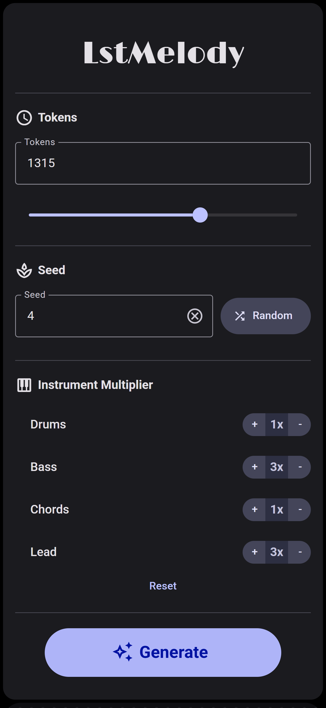

# 📄 LSTMelody

## 💻 Overview

**LSTMelody** is a deep learning project that generates multi-instrument MIDI songs, including drums, bass, chords, and lead instruments. It has a custom LSTM architecture trained on a subset of the Lakh MIDI dataset and an efficient and scalable data pipeline for structured input. It consists of a user-friendly responsive interface built with React, and a FastAPI backend to perform model inference.

## 📚 Tech Stack

- **Frontend:** React  
- **Backend:** FastAPI
- **Machine Learning:** PyTorch

## ♣️ Features

- **Music Generation:** Users can create harmonic, multi-instrument songs with control over song length, starting seed, and instrument probability.

- **Music Gallery:** Generated music can be played back using integrated controls, downloaded as MIDI or WAV, and deleted directly from the gallery.

## 📸 Screenshots

- **Desktop view**:

- **Mobile view**:

  
  &nbsp;&nbsp;&nbsp;
  

## 🔊 Music
Few sample generated tracks

https://github.com/user-attachments/assets/d51d8afa-bb7e-487d-b436-d43cba4bbcb0

https://github.com/user-attachments/assets/7e5462cf-5e2e-4355-957d-3d420eab2e0b

https://github.com/user-attachments/assets/ec385142-1e17-45a5-a045-9c7e4dcac7b5

## 📦 Required Artifacts

The project requires a few non source-code files to run that are too large to be hosted on GitHub. Download and place them in mentioned locations with the correct filenames.

- backend/weights.pth : Trained model weights.
  
  [Download LSTMelody_weights_v1.pth](https://drive.google.com/file/d/1iXFIbDTBlce62j_zeBkgCZTbHRMlBhWT/view?usp=sharing)

- backend/meta.pth : Metadata containing normalization coefficients.
  
  [Download LSTMelody_meta_v1.pth](https://drive.google.com/file/d/1XMLCD9nvilFmZmarBjttomkCjpXN2Jev/view?usp=sharing)

- backend/seeds.pth : File containing 10 starting sequences for song generation.
  
  [Download LSTMelody_seeds_v1.pth](https://drive.google.com/file/d/1vngYYrSZdu4aqQ33Ikp7iV9evZ9pnDwn/view?usp=sharing)

- backend/FluidR3_GM.sf2 : Soundfont used by FluidSynth for rendering MIDI files to WAV.
  
  [Download FluidR3_GM.sf2](https://drive.google.com/file/d/1f0OfVrfhGyjWwVl_nS1mucT59QjX8fRy/view?usp=sharing)

- Files shared between training/ and backend/ were removed from training/ to avoid duplication.

## 📈 Training Results

- As the model is an LSTM-based architecture trained on only 1000 songs, it struggles to capture intricate musical patterns effectively. This limitation leads to the performance plateauing in some aspects even after extended training.
- It was trained on a Mobile Nvidia RTX 3060 for approximately 8 hours.

## 👥 Contributors

- [Anirudh Vignesh](https://github.com/meowAni)
- [Divyesh Dileep](https://github.com/Divyesh48960)
